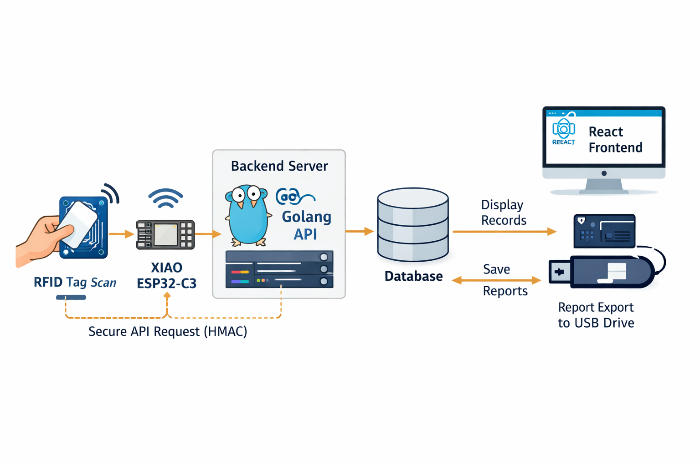

📌 RFID Attendance Firmware – XIAO ESP32-C3
============================================

Repository ini berisi firmware production-ready untuk perangkat absensi RFID berbasis Seeed Studio XIAO ESP32-C3.
Copyright 2025 @maonks


Firmware ini bertugas untuk
----------------------------

- Membaca UID kartu RFID
- Mengirim data absensi ke backend server
- Menjaga keamanan komunikasi (HMAC SHA-256)
- Menangani kondisi offline (data disimpan sementara)
- Memberikan feedback buzzer saat kartu dibaca

Alur Proses Project
--------------------




Fitur Utama
------------

🔐 Secure API Communication (HMAC SHA-256)
📶 Auto WiFi Reconnect
📴 Offline Queue saat jaringan terputus
⏱️ Timestamp berbasis NTP
🔔 Buzzer feedback
🧩 Modular code structure (mudah dikembangkan)


Arsitektur Firmware
--------------------

```text
rfid-absen-firmware/
├── rfid-absen-firmware.ino      # Entry point Arduino
├── README.md
│
├── config/                      # Konfigurasi device & environment
│   ├── config.h
│   └── secrets.h.example
│
├── core/                        # WiFi & HTTP client
│   ├── wifi_manager.c
│   ├── wifi_manager.h
│   ├── http_client.c
│   └── http_client.h
│
├── rfid/                        # Pembacaan kartu RFID
│   ├── rfid_reader.c
│   └── rfid_reader.h
│
└── utils/                       # Crypto, buzzer, helper
    ├── crypto.c
    ├── crypto.h
    └── buzzer.h

```

Hardware yang Didukung
-----------------------

- Seeed Studio XIAO ESP32-C3
- RFID Reader (MFRC522 / kompatibel)
- Buzzer aktif
- Koneksi WiFi 2.4GHz


Cara Penggunaan Singkat (Arduino IDE)
-------------------------------------

- Clone / download repository
- Buka folder repository di Arduino IDE (2.3.6 Recomended)
- Copy config/secrets.h.example → secrets.h
- Isi WiFi & API secret
- Pilih board XIAO ESP32-C3
- Upload firmware
- Testing
